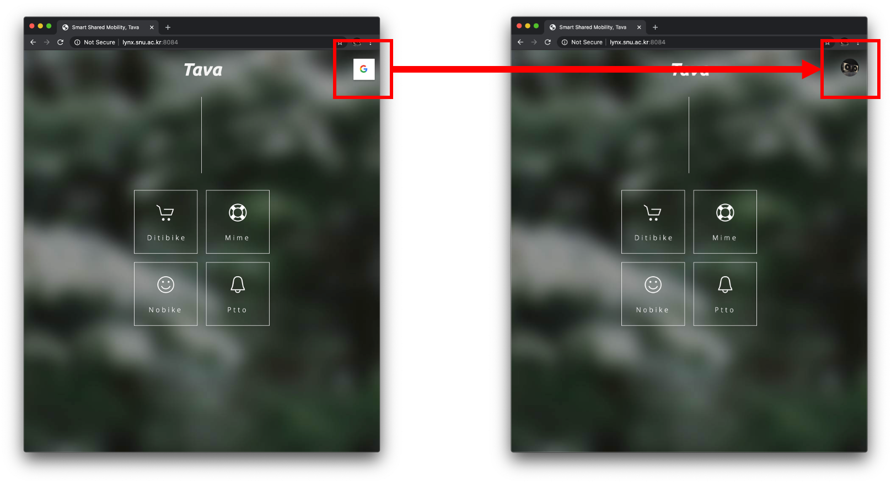
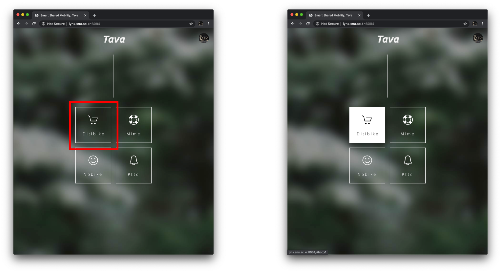
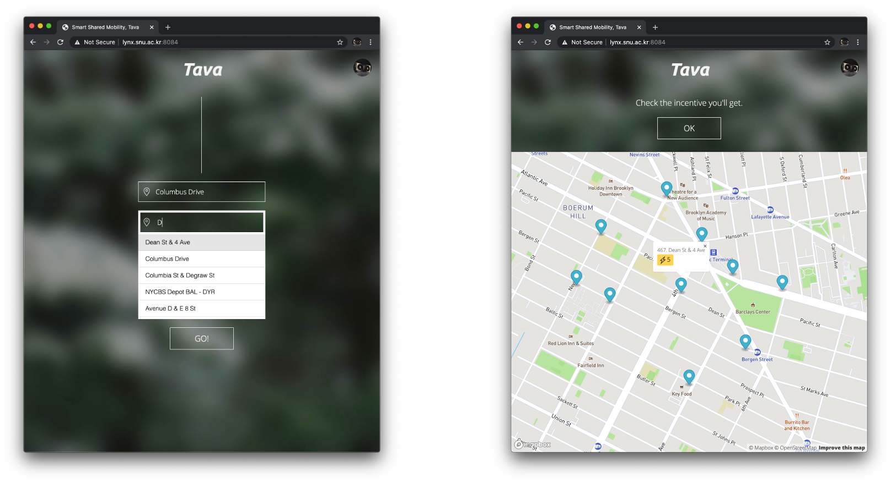
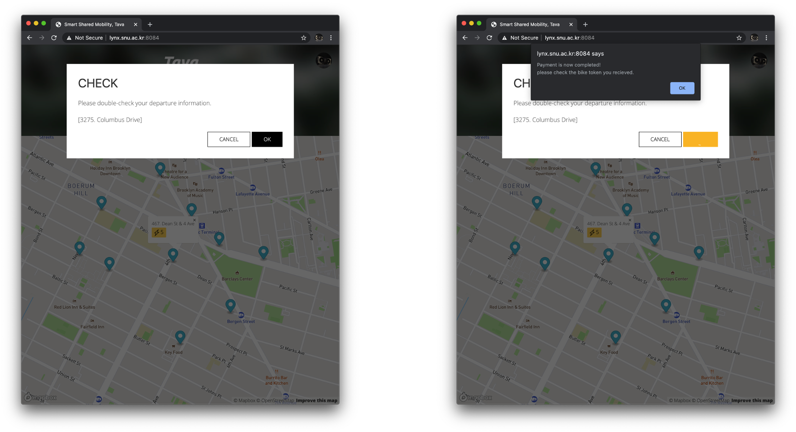
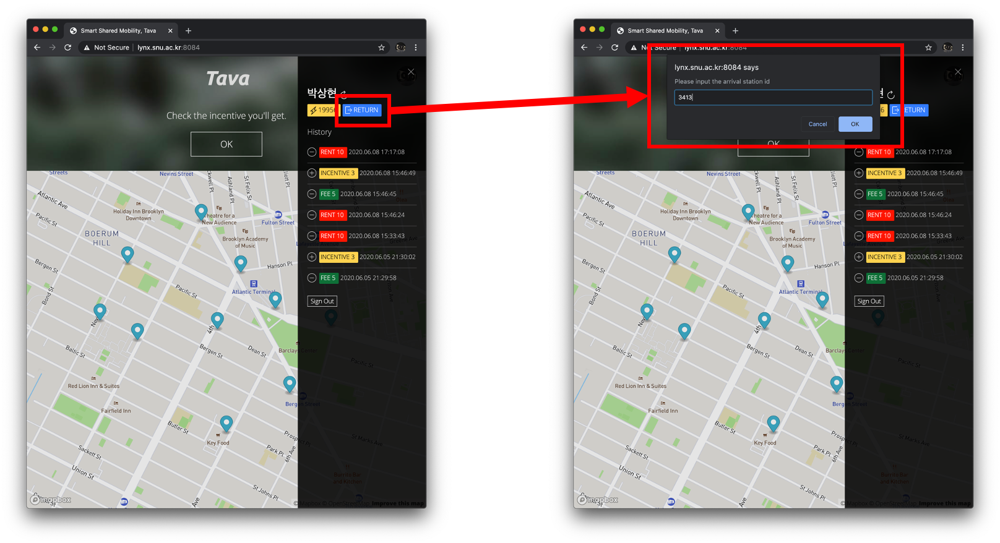
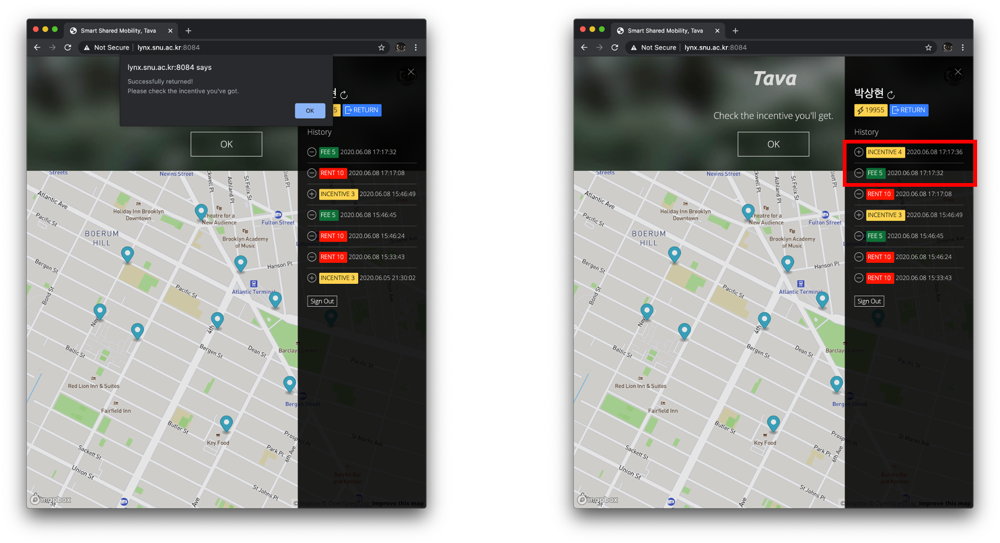

# How to run Tava

### Run Gecko

1. [Install & Run Gecko](./docs/gecko.md#install--run-gecko)

### Initialize Tava

1. [Run Tava initialize script](./docs/Tava_init.md#run-tava-initialize-script)

### Run DNN-server

1. [Clone & Install requirements](./docs/DNN-server.md#clone--install-requirements)
2. [Training DNN model](./docs/DNN-server.md#training-model)
3. [Run inference server](./docs/DNN-server.md#run-inference-server)

### Run Frontend

1. [Clone & Install packages](./docs/frontend.md#clone--install-packages)
2. [Set hardcoded factors](./docs/frontend.md#set-hardcoded-factors)
4. [Run frontend server](./docs/frontend.md#run-server)

### Run Simulator

1. [Clone & Install requirements](./docs/simulator.md#clone--install-requirements)
2. [Run simulator](./docs/simulator.md#run-simulator)
3. [Visualization](./docs/simulator.md#visualization)

See details in each repository: [Gecko](https://github.com/t-ava/gecko), [Pyslopes](https://github.com/t-ava/pyslopes), [DNN-server](https://github.com/t-ava/citibike-DNN), [frontend](https://github.com/t-ava/tava-frontend), and [simulator](https://github.com/t-ava/tava-simulator).

# Videos

## Introduction of Tava

## Tava Demo

## Simulator Demo

## Live Demo

You can enjoy **Tava live demo** at [here](http://lynx.snu.ac.kr:8084/).

# How to use

## Login via Google OAuth

Login process requires Google ID.

## Click Ditibike

In demo, renting Ditibike is provided only.

## Type Source & Destination

10 stations near by destination is shown in the map.
Check the incentives you can get when you return the device after 1 hour.

## Rent

Press the 'OK' button.
You can see the "Payment is now completed!" message if the payment is completed successfully on AVA.
* Enough AVA coin is required.
* In demo, there are 20000 coins are given as a sample.

## Return

Press the user icon. Then, press the 'RETURN' button.
Input the arrival station id (For example, 3413) .

## Check Incentives

After returning process, you can see the fees and incentives.
* Fees: total rental cost.
* Incentives: redistribution rewards.
