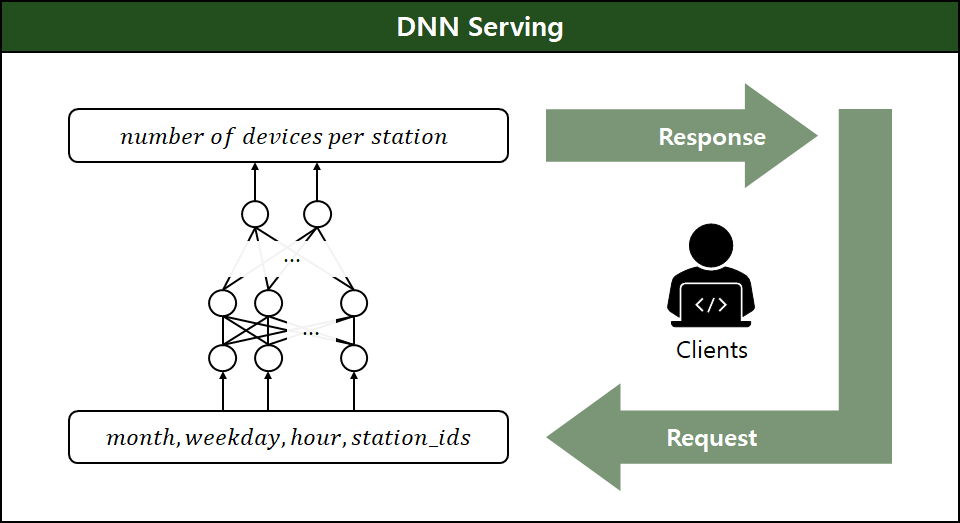
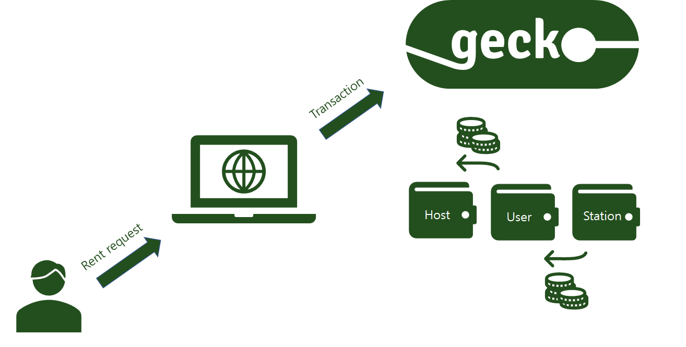

# TAVA: Smart Shared Mobility

## Motivation

Vehicle redistribution is a serious challenge for micro-mobility operators, e.g. city governments that run public bicycles or scooter-sharing startups. Unfairly distributed vehicles can greatly decrease availability and sustainability of the service vehicles.

However, the manpower required for manually redistributing these vehicles are often very costly. Also, some local government policies may limit the time allowed for redistribution work. We start from this motivation and tackle this problem from a different perspective by automating the process of micro-mobility redistribution.

## TAVA

TAVA is a blockchain-based platform that aims to incentivize mobility users that help maximizing global vehicle availability (the name TAVA means "take a ride" in Korean) .

Our main idea is to provide rewards for mobility users that help solve the vehicle overflow problem, i.e. those who disperse vehicles to less crowded docks (stations) . In order to make normal users participate in our platform, we show some alternative parking spots that the user can arrive at near the destination address. This reward system can be helpful for mobility users who want to save their pockets when using these vehicles.

On the other hand, mobility operators can benefit from the automatic redistribution process, and even attract new users into the mobility platform as the vehicles become available at lower prices.

As such, our service suggests a solution that can benefit both parties and ultimately aims to help make our future transports more available and sustainable.

# System Design

We resort to two key technologies for implementing our main idea: machine learning and blockchain.

## Machine Learning

Firstly, we design a machine learning model that predicts the future vehicle availability at each vehicle dock every hour. The role of this model is to compute the incentive of each vehicle ride based on that prediction, in such a way that the global vehicle availability is maximized. Below is a diagram of our machine learning model.

As shown in the diagram, our model takes a station id as well as the current time information as input, and outputs the number of expected available vehicles at that dock during the next one hour.

As an initial prototype, we built a neural network and trained it with the citibike 2019 data. Our model predicts the number of available bicycles with MAE (mean absolute error) less than 2 ([source code](https://github.com/t-ava/citibike-DNN)) .

## AVA Blockchain

The second infrastructure is the AVA blockchain. Our application server interacts with AVA for the payment of a vehicle ride and also for receiving the reward for that ride. Thanks to the high performance of AVA and its avalanche protocol, AVA is highly suitable for processing micropayment transactions initiated by hundreds of thousands of mobility users quickly and efficiently.

We thus resort to the smart assets of AVA blockchain for implementing vehicle rentals as transactions on the blockchain. Below is a sketch of our platform’s micropayment transaction with the AVA blockchain.

When a user connects to the TAVA platform, she delegates the rights on her AVA account to our app server after which the server makes blockchain transactions on her behalf. On a user's request for a vehicle rent, the server makes transactions with an AVA node for micro-payment and receiving rewards for the vehicle ride.

We implemented our prototype for a Gecko node, and have suggested some [feature upgrades]((https://github.com/ava-labs/gecko/pull/179)) to the gecko community during our implementation.

In practice, since we compute the rewards of a vehicle ride in a machine learning server outside the blockchain, we implement an interface named *Pyslopes* that bridges seamless integration of these two backends. It is inspired by the actively maintained JavaScript library, [*slopes*](https://github.com/ava-labs/slopes), and allows a client to issue commands to the AVA node APIs. We open-sourced Pyslopes on [github](https://github.com/t-ava/pyslopes) for its public use.

Overall, these core components efficiently bring together the off-chain computation and on-chain transactions of our reward system.

# Frontend

As for the frontend of our platform, we built a web application that implements the core interactions between our platform and mobility users. Essentially, a mobility user can connect to the platform via google oauth authentication, choose a mobility vendor of interest, and make a vehicle rental/return request on which the app server makes appropriate AVA asset transactions. The user can also check of his/her transaction history in the side menu.

We provide the [source code](https://github.com/t-ava/tava-frontend) and a [working prototype](http://lynx.snu.ac.kr:8084/) of the web application publicly. 

# Proof of Concept

As an overall evaluation of our platform, we model the TAVA as a system with a set of configurable parameters, so as to simulate various scenarios that can happen during the operation of our platform. We control the number of users, vehicle docks, etc. at various levels as well as the policies for deciding rewards of a vehicle ride, in order to find the best parameter configurations for any given scenario.

Based on this simulation results, we can choose appropriate incentive policies for a new mobility operator that wants to join the TAVA platform.

Evaluation with our open-source [prototype simulator](https://github.com/t-ava/tava-simulator) shows that TAVA is capable of serving multiple mobility operators as client companies. 
