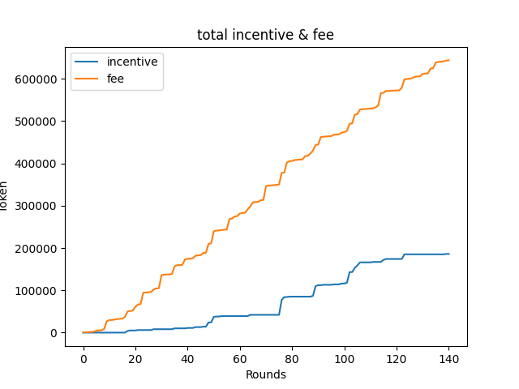

# Clone & Install requirements

```
git clone https://github.com/t-ava/tava-simulator.git
```

```
pip install -r requirements.txt
```

# Run simulator

## Help
```
python src/main.py -h
```
```
usage: main.py [-h] [--fee F] [--additional A] [--time T] [--active P]
               [--missing M] [--users U] [--round R] [--balance B]
               [--mechanism S] [--coef C] [--power X] [--exp E]

Hyperparameters

optional arguments:
  -h, --help      show this help message and exit
  --fee F         default rent fee
  --additional A  additional fee per 1h
  --balance B     default balance
  --time T        default rent time
  --active P      active ratio
  --missing M     missing ratio
  --users U       number of users
  --round R       number of rounds (h)
  --mechanism S   incentive system (0: linear, 1: power, 2: exponential)
  --coef C        incentive coef.
  --power X       incentive power
  --exp E         incentive exp.
```

More details here: [arguments.py](https://github.com/t-ava/tava-simulator/blob/master/src/arguments.py)

## Example
```
python src/main.py --round=2000 --users=200 --time=2
```

## Logs
Logs will be saved in `./logs` after executing `./src/main.py` or `run.sh`.
* `run.sh` is the batch of `./src/main.py` with multiple (diff.) params.

# Visualization

## Help
```
python src/visualization.py -h
```
```
usage: visualization.py [-h] [--log L] [--show]

Name of log file

optional arguments:
  -h, --help  show this help message and exit
  --log L     name of log file
  --show      show figs
```

More details here: [visualization.py](https://github.com/t-ava/tava-simulator/blob/master/src/visualization.py)

## Example

```
python src/visualization.py --log="log_1591204931_mechanism_0.json" --show
```
```
> Setting: Namespace(log='log_1591204931_mechanism_0.json', show=True)
```



